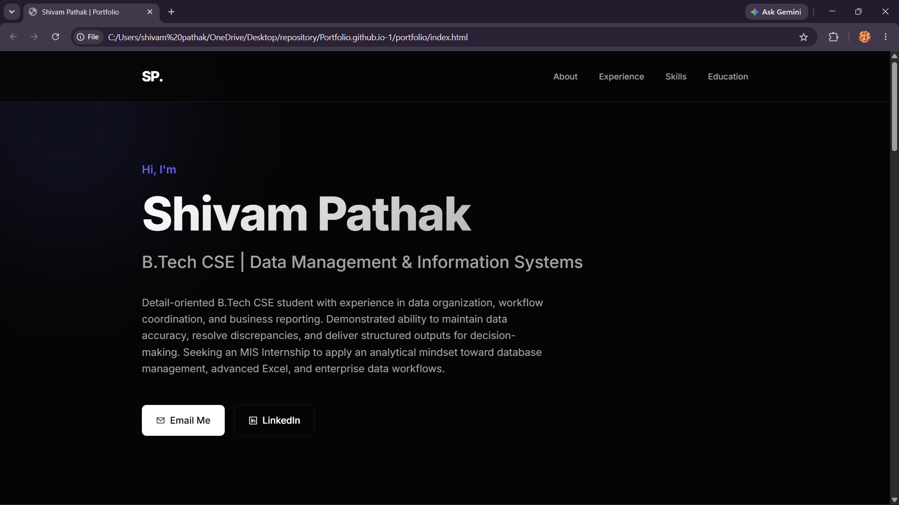

# 👨‍💻 Shivam Pathak | Personal Portfolio

[](https://shivamxxpathak.github.io)
[](https://www.linkedin.com/in/shivam-pathak-675832202)
[](https://github.com/Shivamxxpathak)

> A modern, responsive portfolio showcasing data science projects, machine learning expertise, and analytics capabilities. Built with clean code and professional design principles.

This project has been updated with live project links, a working resume download target, and clickable certifications aligned to the portfolio checklist.



## 🎯 About This Portfolio

This is my personal portfolio website designed to showcase my journey in **Data Science, Machine Learning, and Data Analytics**. The site features:

✨ **Modern Design** — Clean, dark-themed interface with glassmorphism effects  
🎨 **Interactive Elements** — Smooth animations and hover effects  
📱 **Fully Responsive** — Optimized for desktop, tablet, and mobile  
⚡ **Fast Performance** — Pure HTML, CSS, and JavaScript (no frameworks)  
🔍 **SEO Optimized** — Structured content for better visibility

## 📋 Sections Included

### 1. **Hero Section**
- Eye-catching introduction with clear value proposition
- Quick action buttons (Resume, Email, LinkedIn, GitHub)
- Professional headline and summary

### 2. **About Section**
- Personal introduction
- Mission and values statement
- Learning philosophy

### 3. **Featured Projects** (Most Important!)
- **Drug Classification Using ML** — Classification model with 95%+ accuracy
- **SuperStore Sales Analysis** — Comprehensive EDA and insights
- **Python Practice Repository** — Data structures and automation

Project links are connected to the corresponding GitHub repositories and open in a new tab for quick review.

Each project includes:
- Project description
- Technology stack (with visual badges)
- GitHub link
- Live demo link (when available)

### 4. **GitHub Statistics**
- Automatically updated GitHub stats
- Top languages used
- Contribution insights

### 5. **Skills Section**
Organized into categories:
- **Programming** — Python, SQL, Java, HTML, CSS, JavaScript
- **Data Analytics** — Pandas, NumPy, Matplotlib, Excel, EDA
- **Machine Learning** — Scikit-learn, Classification, Regression, Model Evaluation
- **Tools & Platforms** — Git, GitHub, Google Colab, Jupyter, VS Code

### 6. **Experience Section**
Timeline format showing:
- Head of Marketing & Public Relations (Aug 2025 – Present)
- Marketing Executive (Oct 2024 – Aug 2025)
- Marketing Team Member (Apr 2024 – Aug 2025)

Each position highlights data management and analytics achievements.

### 7. **Certifications Section**
- IBM AI Fundamentals
- IBM Data Science Professional
- IBM Design Thinking
- IBM Project Management Fundamentals
- IBM Professional Skills

### 8. **Education Section**
- B.Tech CSE (Expected June 2027) — IITM, Delhi
- B.Tech CS (July 2023) — MDU
- Standard 12th (Apr 2016 – Mar 2023) — Convent of Gagan Bharti

## 💻 Technical Skills

**Frontend Technologies:**
- HTML5
- CSS3 (with custom properties and animations)
- Vanilla JavaScript (no frameworks)
- Responsive design with CSS Grid and Flexbox

**Featured Techniques:**
- Intersection Observer API for scroll animations
- Parallax effects
- Smooth scrolling
- Performance monitoring
- Mobile-first design

**Tools & Platforms:**
- Git & GitHub
- VS Code
- Google Colab
- Jupyter Notebook

## 🎨 Design Features

### Visual Effects
- **Animated blobs** — Floating background elements
- **Smooth transitions** — All interactive elements have smooth animations
- **Hover effects** — Cards and buttons respond to user interaction
- **Gradient text** — Eye-catching section titles
- **Glassmorphism** — Modern card design with blur effects
- **Scroll animations** — Sections fade in as you scroll

### Responsive Breakpoints
- Desktop: Full experience with all features
- Tablet (768px): Optimized layout and touch-friendly buttons
- Mobile (480px): Single column layout, simplified navigation

### Accessibility
- Semantic HTML
- Proper contrast ratios
- Keyboard navigation support
- ARIA labels where needed

## 🚀 Setup & Deployment

### Running Locally

1. **Clone the repository:**
   ```bash
   git clone https://github.com/Shivamxxpathak/Portfolio.github.io.git
   cd Portfolio
   ```

2. **Method 1: Using Python's built-in server**
   ```bash
   python -m http.server 8000
   # Then open http://localhost:8000 in your browser
   ```

3. **Method 2: Using Node.js**
   ```bash
   npx http-server
   # Server will run on http://localhost:8080
   ```

4. **Method 3: Direct browser access**
   - Simply open `index.html` in your browser

### Deploying to GitHub Pages

1. Push your code to GitHub:
   ```bash
   git add .
   git commit -m "Update portfolio"
   git push origin main
   ```

2. Enable GitHub Pages in repository settings:
   - Go to Settings → Pages
   - Select "Deploy from a branch"
   - Choose `main` branch and save

3. Your site will be live at `https://yourusername.github.io`

## 🔧 Customization Guide

### Update Personal Information
Edit `index.html`:
```html
<!-- Update your name -->
<h1 class="name">Your Name</h1>

<!-- Update your headline -->
<h3 class="headline">Your Headline</h3>

<!-- Update contact links -->
<a href="mailto:your.email@example.com">Email Me</a>
```

### Modify Colors
Edit `style.css` (`:root` section):
```css
:root {
    --accent-color: #6366f1; /* Change accent color */
    --bg-color: #050505;     /* Change background */
    /* ... other variables ... */
}
```

### Add/Update Projects
Add new project cards in the `#projects` section:
```html
<div class="project-card card">
    <div class="project-header">
        <h3>Your Project Name</h3>
        <span class="project-badge">Category</span>
    </div>
    <!-- ... rest of project details ... -->
</div>
```

### Update GitHub Stats
Replace username in `#github-stats` section:
```html

```

### Add Resume Download
1. Upload your resume PDF to your repository
2. Update the resume link in hero section:
```html
<a href="path/to/your-resume.pdf" class="btn primary-btn download-resume">
    <i class="ph ph-download-simple"></i> Download Resume
</a>
```

## 📊 SEO Optimization

The portfolio includes:
- ✅ Relevant keywords naturally integrated
- ✅ Meta descriptions for search engines
- ✅ Semantic HTML structure
- ✅ Mobile-friendly design (important for Google ranking)
- ✅ Fast loading times
- ✅ Proper heading hierarchy
- ✅ Alt text for images (when used)

**Keywords included:** Data Analytics, Machine Learning, Python, SQL, Data Visualization, Exploratory Data Analysis, Predictive Modeling, Scikit-learn, Pandas, NumPy, Data Science

## 🎬 Key Features

### Performance
- ⚡ No external frameworks (vanilla JS only)
- 📦 Minimal dependencies (only Phosphor Icons from CDN)
- 🚀 Fast load times
- ♿ Accessibility-first design

### User Experience
- 🎯 Clear visual hierarchy
- 📍 Sticky navigation
- 🖱️ Intuitive interactions
- 📱 Mobile optimization
- ♿ Keyboard navigable

### Recruiter-Friendly
- 🎯 Clear value proposition
- 📊 Featured projects section
- 💼 Achievement-oriented experience descriptions
- 🏆 Certifications showcase
- 📈 GitHub stats integration

## 📞 Contact & Social

- **Email:** shivam987pathak@gmail.com
- **LinkedIn:** [Shivam Pathak](https://www.linkedin.com/in/shivam-pathak-675832202)
- **GitHub:** [Shivamxxpathak](https://github.com/Shivamxxpathak)

## 📝 License

This portfolio is open source. Feel free to use it as a template for your own portfolio!

---

**Last Updated:** 2026  
**Built with:** ❤️ using HTML5, CSS3, and JavaScript
